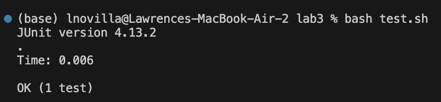
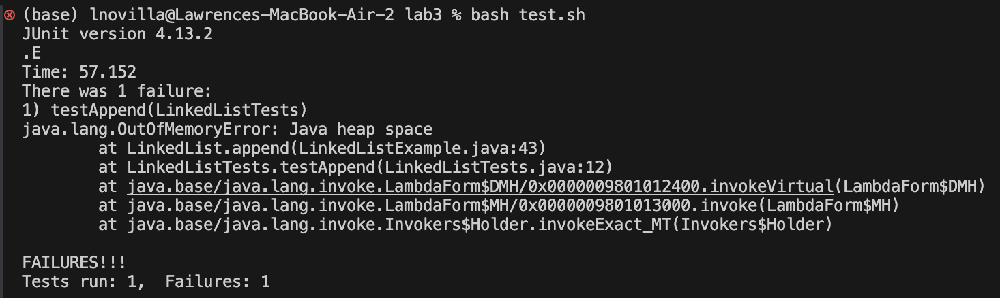

# Lab Report 3
## ```LinkedListExample.java``` ```append()``` (Original code)
```
public void append(int value) {
  if(this.root == null) {
    this.root = new Node(value, null);
    return;
  }
  // If it's just one element, add if after that one
  Node n = this.root;
  if(n.next == null) {
    n.next = new Node(value, null);
    return;
  }
  // Otherwise, loop until the end and add at the end with a null
  while(n.next != null) {
    n = n.next;
    n.next = new Node(value, null);
  }
}
```
## Test That Will Not Induce a Fail
```
@Test
public void testAppendTwoElements(){
  LinkedList list = new LinkedList();
  list.append(1);
  list.append(2);

  assertEquals(1, list.root.value);
  assertEquals(2, list.root.next.value);
}
```
Output:


## Test That Will Induce a Fail
```
public void testAppendThreeElements(){
  LinkedList list = new LinkedList();
  list.append(1);
  list.append(2);
  list.append(3);

  assertEquals(1, list.root.value);
  assertEquals(2, list.root.next.value);
  assertEquals(3, list.root.next.next.value);
}
```
Output:



Bug: The issue with the ```append()``` method is the while loop for linked lists with more than 1 element. The loop attempts to add a new Node when it reaches a node which has null for its next value. However, it continues to loop and initializes a next value for each iterated node. Therefore, it loops infinitely since a node will always have a next value before it is checked if it is null.

## Fixed Code
```
public void append(int value) {
  if(this.root == null) {
    this.root = new Node(value, null);
    return;
  }
        
  Node n = this.root;
        
  while(n.next != null) {
    n = n.next;
  }
        
  n.next = new Node(value, null);
}
```
This fixes the issue of appending onto linked lists with more than 1 element because the while loop will iterate until it reaches a node without a next, exits the loop, then initializes the new next node at the end of the list.

# find command

## find -name
Search: "find command line options"
Source: https://www.redhat.com/sysadmin/linux-find-command
```
(base) lnovilla@Lawrences-MacBook-Air-2 technical % find ./plos -name "pmed.001001*"
./plos/pmed.0010010.txt
./plos/pmed.0010013.txt
```
The find -name command is returning every path for files that starts with "pmed.001001". This could be useful if you are looking for a list of files within a big folder with the same starting name.
```
(base) lnovilla@Lawrences-MacBook-Air-2 technical % find ./government/Env_Prot_Agen -name "*skies*"
./government/Env_Prot_Agen/ro_clear_skies_book.txt
```
The find -name command is returning every path for files that contain the string "skies" within the file name. This can be useful to find the path of a file that you only know part of the name.

## find -type
Search: "find command line options"
Source: https://www.redhat.com/sysadmin/linux-find-command
```
(base) lnovilla@Lawrences-MacBook-Air-2 technical % find ./government -type d
./government
./government/About_LSC
./government/Env_Prot_Agen
./government/Alcohol_Problems
./government/Gen_Account_Office
./government/Post_Rate_Comm
./government/Media
```
The find -type command is returning the paths for all directories within the path. This can be useful if you just want a list of directory paths rather than files.
```
(base) lnovilla@Lawrences-MacBook-Air-2 technical % find ./plos  -type f -empty
./plos/emptyFile.txt
```
The find -type command with help of -empty returns the path of any file that is empty. This can be helpful if you want to find and remove empty files in a large folder.

## find -size
Search: "How to use find command"
Source: https://linuxconfig.org/how-to-use-find-command-to-search-for-files-based-on-file-size
```
(base) lnovilla@Lawrences-MacBook-Air-2 technical % find ./biomed -size +100k
./biomed/1471-2105-3-2.txt
```
The find -size command is returning the paths for any files in the given directory that have a size more than 100 kilobytes. This can help if you are sorting out large files.
```
(base) lnovilla@Lawrences-MacBook-Air-2 technical % find ./biomed -size +10k -size -12k
./biomed/1477-7819-1-10.txt
./biomed/1471-2105-3-24.txt
./biomed/cc973.txt
./biomed/1471-2156-2-8.txt
./biomed/1471-230X-2-17.txt
./biomed/1471-2350-2-8.txt
```
The find -size command is returning the path for any files in the directory that have a size more than 10 kilobytes but less than 12 kilobytes. This can help if you are locating files with certain size ranges.

## find -delete
Search: "how to find and delete command"
Source: https://www.cyberciti.biz/faq/linux-unix-how-to-find-and-remove-files/
```
(base) lnovilla@Lawrences-MacBook-Air-2 technical % find ./biomed  -name "1468*" -delete        
(base) lnovilla@Lawrences-MacBook-Air-2 technical % 
```
The find -delete command removed every file in the given directory starting with 1468. This can be useful if you are trying to remove many files that share parts of their fiel name.
```
(base) lnovilla@Lawrences-MacBook-Air-2 technical % find ./biomed  -type f -delete        
(base) lnovilla@Lawrences-MacBook-Air-2 technical % 
```
Here, the find -delete command is used to remove every file in the given path that is file type .txt. This can be useful if you are removing many files of the same type.
